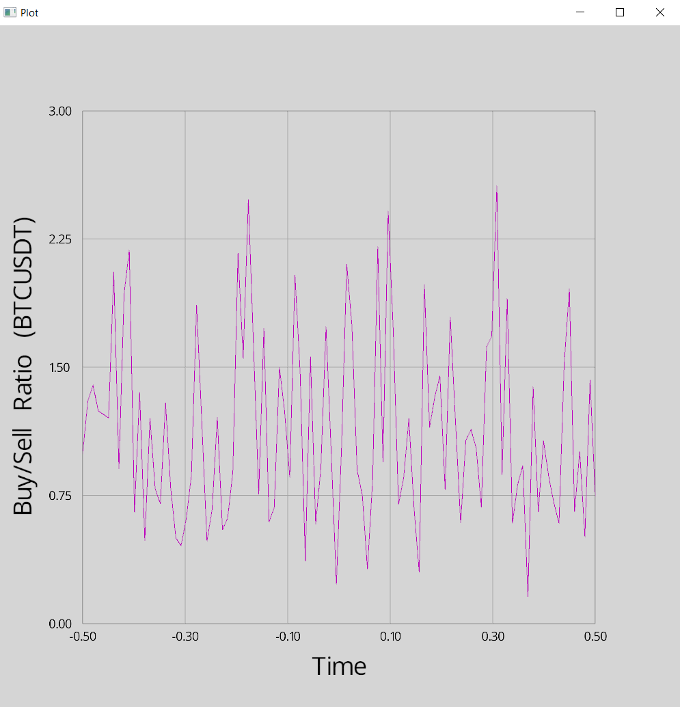

# Real-Time Buy/Sell Ratio Plot for BTCUSDT

This project is a Rust-based application that fetches and visualizes the buy/sell ratio data for the cryptocurrency pair BTCUSDT in real-time. The data is fetched from the Binance Futures API and displayed dynamically using the `rtplot` library.

## Features

- **Real-Time Data Fetching**: Periodically fetches buy/sell ratio data from Binance.
- **Dynamic Visualization**: Plots the data in real-time using a dynamic line chart.
- **Thread-Safe Design**: Uses thread-safe mechanisms (`Arc` and `Mutex`) to manage data between asynchronous data fetching and plotting.

## Prerequisites

To build and run this project, ensure you have:

- [Rust](https://www.rust-lang.org/) installed (version 1.65 or later recommended).
- A stable internet connection (required to fetch data from Binance).
- The following Rust libraries:
  - `reqwest` (for HTTP requests)
  - `serde_json` (for JSON parsing)
  - `tokio` (for asynchronous runtime)
  - `rtplot` (for real-time plotting)

## Installation

1. Clone this repository:

   ```bash
   git clone https://github.com/sameteraslan/rust-lab.git
   cd rust-lab/binance_analyze
   ```

2. Build the project:

   ```bash
   cargo build --release
   ```

3. Run the project:

   ```bash
   cargo run --release
   ```

## How It Works

1. **Fetching Data**: The program periodically fetches buy/sell ratio data from the Binance Futures API every 5 seconds. The fetched data is parsed and stored in a shared vector.
2. **Real-Time Plotting**: The `rtplot` library dynamically updates the plot on the main thread to visualize the buy/sell ratio data.
3. **Concurrency**: The data fetching and plotting processes run concurrently using Rust's `Arc` and `Mutex` for thread-safe shared data.

## Code Overview

- `main()`: Entry point of the program. Initializes the plot, spawns the data-fetching thread, and manages the real-time plotting loop.
- `Arc<Mutex<Vec<f32>>>`: Ensures thread-safe access to the shared vector holding the buy/sell ratio data.
- **Libraries Used**:
  - `reqwest`: For sending HTTP GET requests to the Binance API.
  - `serde_json`: For parsing JSON responses.
  - `tokio`: For asynchronous operations (e.g., fetching data periodically).
  - `rtplot`: For real-time data visualization.

## API Details

- **Endpoint**: `https://fapi.binance.com/futures/data/takerlongshortRatio`
- **Parameters**:
  - `symbol`: The cryptocurrency pair (e.g., BTCUSDT).
  - `period`: Time interval for the data (e.g., 5m for 5 minutes).
  - `limit`: Number of data points to fetch (default: 100).

## Customization

- **Symbol**: Modify the `symbol` variable in the code to track a different cryptocurrency pair.
- **Interval**: Change the `interval` variable to adjust the time period for the data (e.g., 1m, 15m).
- **Limit**: Update the `limit` variable to fetch more or fewer data points.
- **Plotting Range**: Adjust the Y-axis range in the plot configuration to suit the expected data range.

## Example Output

<div>
    
</div>

The program will display a real-time line chart of the buy/sell ratio for BTCUSDT. The X-axis represents time, and the Y-axis represents the buy/sell ratio.

## License

This project is licensed under the GNU Version 3 License. See the [LICENSE](../LICENSE) file for details.

## Contributing

Contributions are welcome! Feel free to open issues or submit pull requests to improve this project.

## Acknowledgments

- [Binance API](https://binance-docs.github.io/apidocs/futures/en/) for providing real-time data.
- The Rust community for excellent documentation and libraries.
