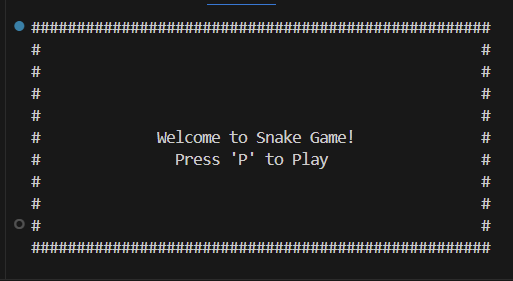
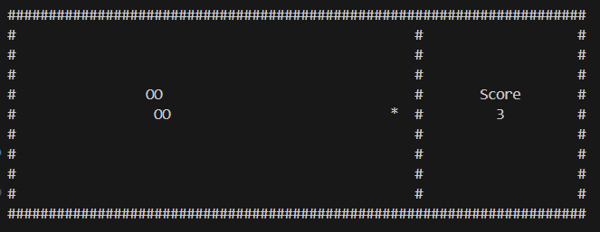
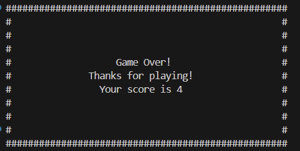

# Snake Game in Rust

## Overview

This project implements a simple snake game using Rust. The game runs in the terminal and uses the `crossterm` library for handling input and output. The player's objective is to control a snake to eat food while avoiding collisions with walls or itself. The game dynamically adjusts its speed as the player scores more points.

## Features

- Real-time snake movement with directional controls.
- Collision detection with walls and self.
- Dynamic game speed based on the score.
- Logging game events to a file.
- Customizable game configuration through a JSON file.

## How It Works

1. **Initialization**:

   - The game initializes a snake in the middle of the terminal screen with a single food item placed randomly.
   - Configuration values such as screen size, speed, and dynamic speed adjustments are read from a JSON file.

2. **Game Loop**:

   - The game continuously listens for user input to control the snake's direction.
   - The snake moves in the current direction and either grows by eating food or shrinks if no food is consumed.
   - If the snake collides with a wall or itself, the game ends.

3. **Drawing**:

   - The game uses the `crossterm` library to draw the snake, food, borders, and scoreboard on the terminal.

4. **End Game**:

   - A "Game Over" screen is displayed with the final score.

## Dependencies

The project uses the following Rust crates:

- `crossterm`: For terminal manipulation.
- `simplelog`: For logging events to a file.
- `serde_json`: For parsing the configuration JSON file.
- `rand`: For generating random positions for the food.

## Installation and Setup

1. Clone the repository:
   ```bash
   git clone <repository-url>
   cd <repository-directory>
   ```
2. Ensure you have Rust installed. If not, install it from [Rust's official website](https://www.rust-lang.org/).
3. Build the project:
   ```bash
   cargo build --release
   ```

## Running the Game

1. Create a `configuration.json` file in the `config` directory with the following structure:
   ```json
   {
       "game_speed": 1,
       "dynamic_game_speed": true,
       "screen_width": 50,
       "screen_height": 20,
       "score_width": 20
   }
   ```
2. Run the game:
   ```bash
   cargo run --release
   ```

## Controls

- `Arrow Keys`: Change the direction of the snake.
- `P`: Start the game from the welcome sclreen.
- `Esc`: Quit the game.

## Logging

Game events and errors are logged to `app.log`. This includes:

- Snake's position.
- Score updates.
- Collision events.

## Customization

Modify the `configuration.json` file to:

- Adjust the game speed.
- Enable or disable dynamic speed adjustments.
- Set the screen dimensions.
- Customize the scoreboard width.

## Example JSON Configuration

```json
{
    "game_speed": 1,
    "dynamic_game_speed": true,
    "screen_width": 50,
    "screen_height": 25,
    "score_width": 15
}
```

## Pictures From Game

<div align="center">
    
    
    
</div>

## Future Enhancements 

- Saving high scores to a file.
- Improved visual effects for the terminal.

## License

This project is licensed under the GNU Version 3 License.

---

Enjoy playing the snake game! Feedback and contributions are welcome.

