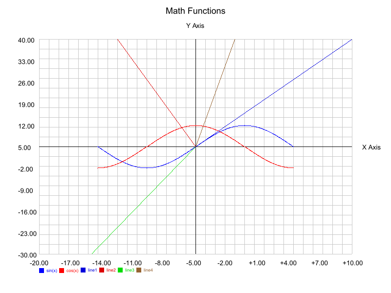
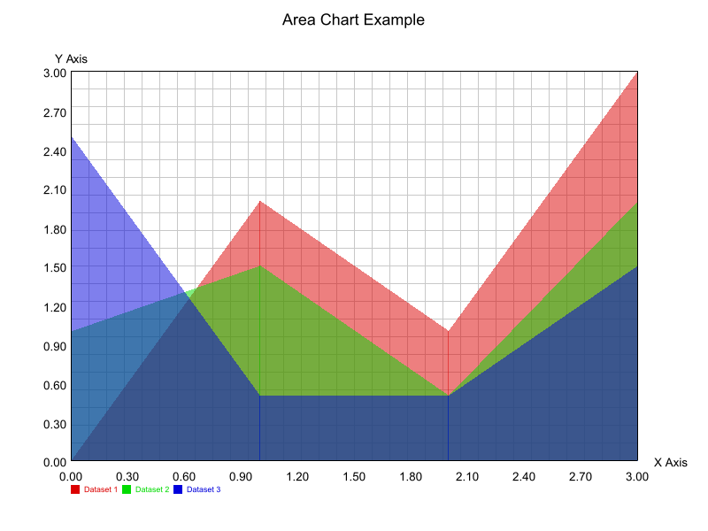
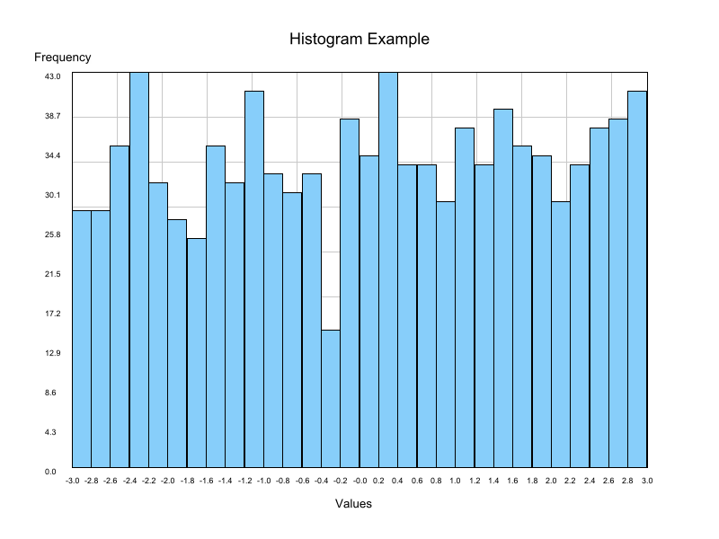
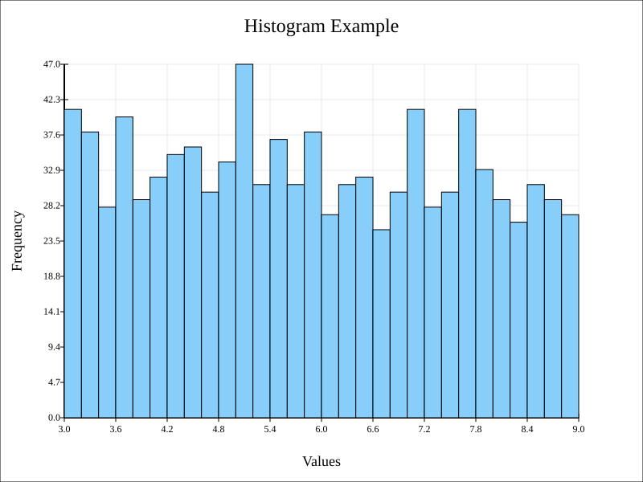

# **DataViz** 🚀  
A modular, customizable, and feature-rich 2D plotting library written in Rust. With **DataViz**, you can create a wide variety of plots tailored to your needs, supporting both raster (PNG) and vector (SVG) outputs.

---

## **Features**  
### **Supported Plot Types**  
- **Bar Charts**: Create grouped horizontal and vertical bar charts.  
- **Scatter Graphs**: Visualize data points with various shapes (circle, square, triangle, etc.).  
- **Pie Charts**: Represent data proportions as slices of a circle.  
- **Area Charts**: Highlight trends with filled areas under data lines.  
- **Histograms**: Analyze frequency distributions with dynamic bin calculations.  
- **Cartesian Graphs**: Plot mathematical functions or datasets on a coordinate plane.  
- **Quadrant 1 Graphs**: Focused plotting in the first quadrant for non-negative data.

### **Customization Options**  
- **Title**: Add meaningful titles to your plots.  
- **Axes Labels**: Define X-axis and Y-axis labels.  
- **Dynamic Scaling**: Automatically fit data within the plot dimensions.  
- **Colors**: Customize colors for the background, axes, and data elements.  
- **Margins**: Add space around the plot for better visibility.  
- **Line and Dot Styles**: Customize line types (solid, dashed, dotted) and dot shapes (circle, square, cross, triangle).  

### **Output Formats**  
- **Raster (PNG)**: Save high-quality images of your plots.  
- **Vector (SVG)**: Generate scalable vector graphics for precision and scalability.  

### **Interactive Capabilities**  
- Hover effects and real-time updates (coming soon).

---

## **Examples**  
### **PNG Outputs**  
  
  
  
  
  
  
  
  
  

### **SVG Outputs**  
  
  
  
  
  
  
  
  

---

## **Installation**  
Add the following dependencies to your `Cargo.toml` file:
```toml
[dependencies]
ab_glyph = "0.2.29"       # Font rendering
image = "0.25"            # Raster image generation
imageproc = "0.25.0"      # Image processing
minifb = "0.27.0"         # Simple framebuffer support
rand = "0.8.5"            # Optional, for generating random test data
resvg = "0.44.0"          # SVG rendering
rusttype = "0.9.3"        # Font processing
```

---

## **Usage Example**  
Here’s how to create a simple pie chart:

```rust
use dataviz::figure::figuretypes::piechart::PieChart;
use dataviz::figure::configuration::figureconfig::FigureConfig;

fn main() {
    let mut pie_chart = PieChart::new("Market Share", FigureConfig::default());
    pie_chart.add_slice("Product A", 40.0, [255, 0, 0]);
    pie_chart.add_slice("Product B", 30.0, [0, 255, 0]);
    pie_chart.add_slice("Product C", 30.0, [0, 0, 255]);

    // Save as PNG or SVG
    pie_chart.draw();
}
```

```rust
fn main() {
    let mut fig = FigureFactory::create_figure(dataviz::figure::figurefactory::FigureType::CartesianGraph);
    let mut canvas = PixelCanvas::new(800, 600, [255, 255, 255], 80);
    fig.draw(&mut canvas);
    canvas.save_as_image("output.png");
}
```

```rust
let figure_config = FigureConfig {
        font_size_title: 20.0,
        font_size_label: 16.0,
        font_size_legend: 14.0,
        color_axis: [0, 0, 0],
        color_background: [0, 0, 0],
        color_grid: [0, 0, 0],
        num_axis_ticks: 20,
        num_grid_horizontal: 20,
        num_grid_vertical: 20,
        font_label: "path/to/font/Arial.ttf"
            .to_string(),
        font_title: "path/to/font/Arial.ttf"
            .to_string(),
        ..Default::default()
    };
    let mut pixel_canvas = SvgCanvas::new(800, 600, "white", 80);
    let mut bar_chart = GroupBarChart::new(
        "Yearly Income",
        "Year",
        "Income",
        Orientation::Vertical,
        figure_config,
    );

    let mut dataset1 = BarDataset::new("Company A", [220, 0, 0]);
    dataset1.add_data(2020.0, 100.0);
    dataset1.add_data(2021.0, 200.0);
    dataset1.add_data(2022.0, 150.0);

    let mut dataset2 = BarDataset::new("Company B", [0, 220, 0]);
    dataset2.add_data(2020.0, 120.0);
    dataset2.add_data(2021.0, 180.0);
    dataset2.add_data(2022.0, 220.0);

    let mut dataset3 = BarDataset::new("Company C", [0, 0, 220]);
    dataset3.add_data(2020.0, 150.0);
    dataset3.add_data(2021.0, 250.0);
    dataset3.add_data(2022.0, 400.0);

    let mut dataset4 = BarDataset::new("Company D", [150, 100, 50]);
    dataset4.add_data(2020.0, 50.0);
    dataset4.add_data(2021.0, 256.0);
    dataset4.add_data(2022.0, 40.0);

    bar_chart.add_dataset(dataset1);
    bar_chart.add_dataset(dataset2);
    bar_chart.add_dataset(dataset3);
    bar_chart.add_dataset(dataset4);

    bar_chart.draw_svg(&mut pixel_canvas);
    pixel_canvas
        .save("grouped_horizontal_bar_chart.svg")
        .unwrap();

    let svg_text = pixel_canvas.get_svg_as_text();
    Winop::display_svg(&svg_text, "Bar Chart Example");
```

```rust
    let handle = thread::spawn(move || {
        let mut pixel_canvas = PixelCanvas::new(800, 600, [255, 255, 255], 80);
        let mut scatter_graph = ScatterGraph::new("Real-Time Scatter Graph", "X", "Y", FigureConfig::default());

        let dataset1 = ScatterGraphDataset::new([0, 220, 0], "Data1", ScatterDotType::Circle(5));
        let dataset2 = ScatterGraphDataset::new([220, 0, 0], "Data2", ScatterDotType::Square(5));
        let dataset3 = ScatterGraphDataset::new([0, 0, 220], "Data3", ScatterDotType::Triangle(5));
        let mut rng = rand::thread_rng();
        scatter_graph.add_dataset(dataset1);
        scatter_graph.add_dataset(dataset2);
        scatter_graph.add_dataset(dataset3);

        // Closure to update scatter graph data
        let update_data = move |graph: &mut ScatterGraph| {
            for i in 0..graph.datasets.len() {
                let x = rng.gen_range(0.0..10.0);
                let y = rng.gen_range(0.0..10.0);
                graph.datasets[i].add_point((x, y));
            }
        };

        // Display the scatter graph in real-time
        Winop::display_real_time(
            &mut PixelCanvas,
            &mut scatter_graph,
            "Real-Time Scatter Graph",
            update_data,
            30,
        );
    });

    handle.join().unwrap();

```

---

## **License**  
This project is licensed under the **GNU General Public License v3.0 (GPL-3.0)**. See the `LICENSE` file for details.

---

## **Contributing**  
We welcome contributions to make **Plotter Library** even better!  
- Report bugs and suggest features through [GitHub Issues](https://github.com/yourusername/yourrepo/issues).  
- Submit pull requests for enhancements or fixes.  

Let’s make data visualization in Rust easy and accessible!

---

Happy Plotting! 🚀
