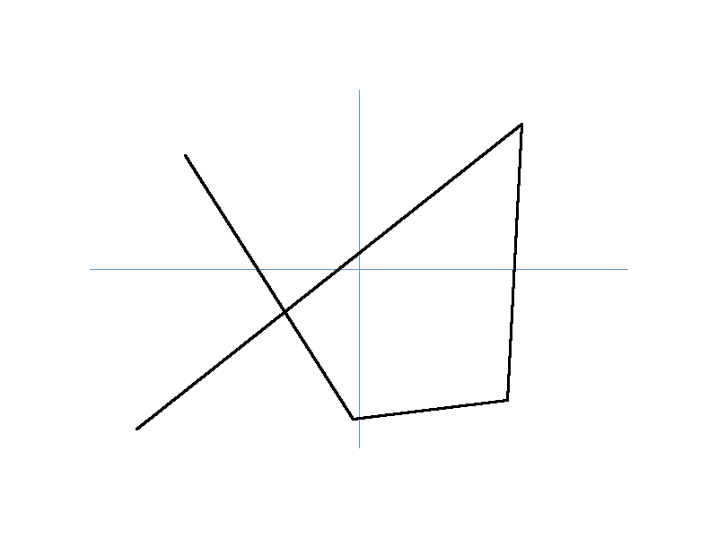

# Plotter Library -> WIP!
This project is a simple yet customizable 2D plotting library written in Rust. It enables the creation of plots with customizable dimensions, colors, axis labels, and data points. The rendered plots can be saved as image files.

## Features
- **Customizable plot dimensions**: Specify the width and height of the plot.
- **Color customization**: Define colors for the background, axes, and data lines.
- **Data visualization**: Plot data points with adjustable line thickness.
- **Dynamic scaling**: Automatically scale data points to fit within the defined axes.
- **Margin support**: Add margins around the plot for better visualization.
- **Save functionality**: Save the rendered plot as an image file.

## Usage

### Example Code
```rust
use my_plotter::Plot;
use rand::Rng;

fn main() {
    // Number of points to plot
    let points_capacity = 5;
    
    // Generate random data points
    let mut points_x: Vec<f64> = Vec::with_capacity(points_capacity);
    let mut points_y: Vec<f64> = Vec::with_capacity(points_capacity);

    for _ in 0..points_capacity {
        points_x.push(rand::thread_rng().gen_range(-500.0..500.0));
        points_y.push(rand::thread_rng().gen_range(-100.0..100.0));
    }

    // Create and customize the plot
    let plot = Plot::new()
        .title("Simple Plot")
        .xlabel("X")
        .ylabel("Y")
        .width(800)
        .height(600)
        .bg_color(&[255, 255, 255])
        .axis_color(&[100, 150, 200])
        .line_thickness(2)
        .add_data(&points_x, &points_y)
        .x_max(500.0)
        .y_max(100.0);

    // Save the plot as an image file
    plot.save("plot.png");
}
```

### Output
The above code generates a plot and saves it as `plot.png` in the current working directory.



## Customization Options
- **Title**: Set the title of the plot.
- **X and Y Labels**: Label the x-axis and y-axis.
- **Dimensions**: Specify the width and height of the plot.
- **Colors**: Customize background, axis, and line colors.
- **Margins**: Add margins around the plot.
- **Line Thickness**: Adjust the thickness of data lines.

## Methods Overview

### `new()`
Creates a new plot instance with default properties.

### `title(&self, title: &str) -> Self`
Sets the title of the plot.

### `xlabel(&self, label: &str) -> Self`
Sets the label for the x-axis.

### `ylabel(&self, label: &str) -> Self`
Sets the label for the y-axis.

### `width(&self, width: u32) -> Self`
Sets the width of the plot.

### `height(&self, height: u32) -> Self`
Sets the height of the plot.

### `bg_color(&self, color: &[u8; 3]) -> Self`
Sets the background color.

### `axis_color(&self, color: &[u8; 3]) -> Self`
Sets the color of the axes.

### `line_color(&self, color: &[u8; 3]) -> Self`
Sets the color of the data lines.

### `line_thickness(&self, thickness: u32) -> Self`
Sets the thickness of the data lines.

### `x_max(&self, max: f64) -> Self`
Sets the maximum x-axis value and adjusts the minimum to `-max`.

### `y_max(&self, max: f64) -> Self`
Sets the maximum y-axis value and adjusts the minimum to `-max`.

### `add_data(&self, x: &[f64], y: &[f64]) -> Self`
Adds data points to the plot.

### `save(&self, filename: &str)`
Renders the plot and saves it as an image file.

## Installation

Add the following to your `Cargo.toml`:
```toml
[dependencies]
image = "0.24"    # For rendering images
nalgebra = "0.30" # For handling data (optional)
rand = "0.8.5"    # For testing (optional)
```

## License
This project is licensed under the GNU Version 3 License.

## Contributing
Contributions are welcome! Feel free to open issues or submit pull requests to improve the library.

---

Happy plotting! 🚀
