# Plotter Library -> WIP!
This project is a simple yet customizable 2D plotting library written in Rust. It enables the creation of plots with customizable dimensions, colors, axis labels, and data points. The rendered plots can be saved as image files.

## Features
- **Customizable plot dimensions**: Specify the width and height of the plot.
- **Color customization**: Define colors for the background, axes, and data lines.
- **Data visualization**: Plot data points with adjustable line thickness.
- **Dynamic scaling**: Automatically scale data points to fit within the defined axes.
- **Margin support**: Add margins around the plot for better visualization.
- **Save functionality**: Save the rendered plot as an image file.


### PNG Outputs


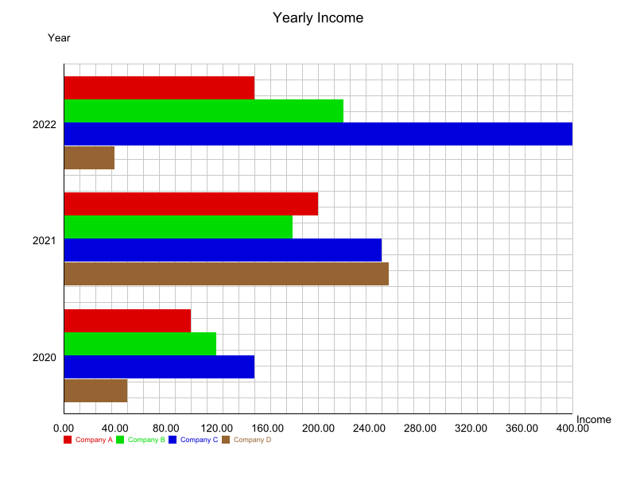
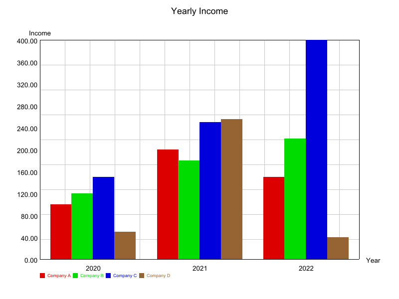
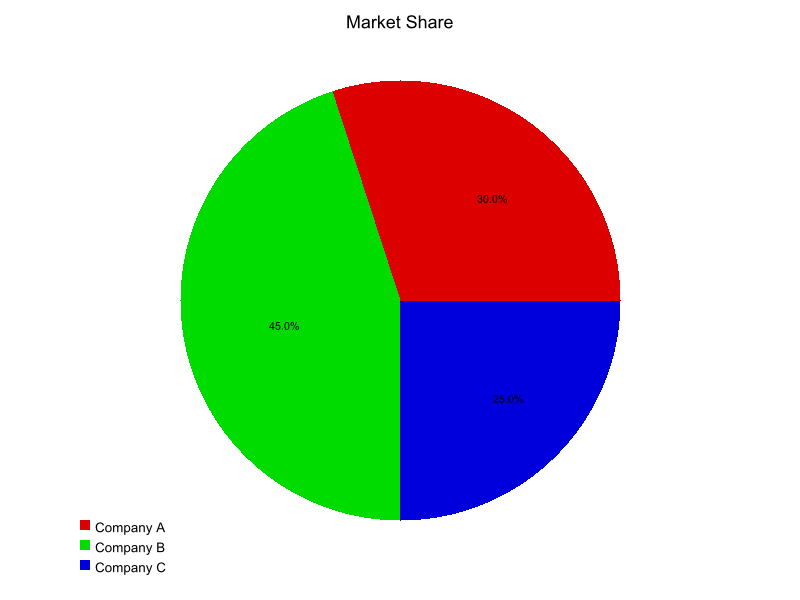
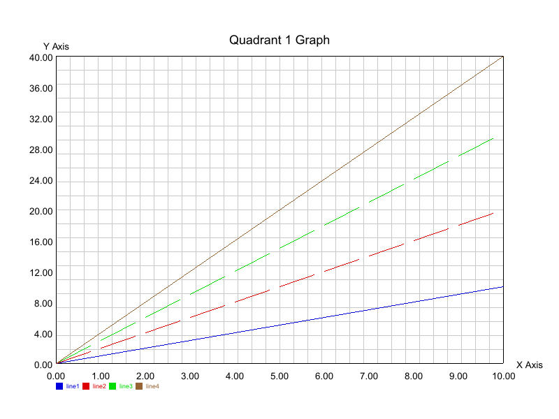
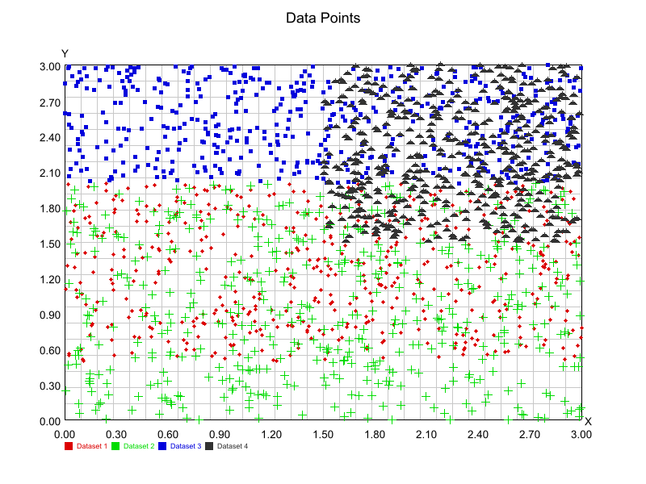


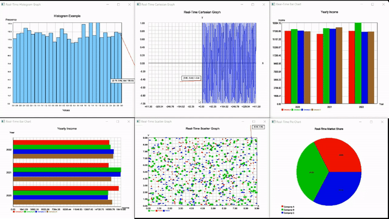


### SVG Outputs

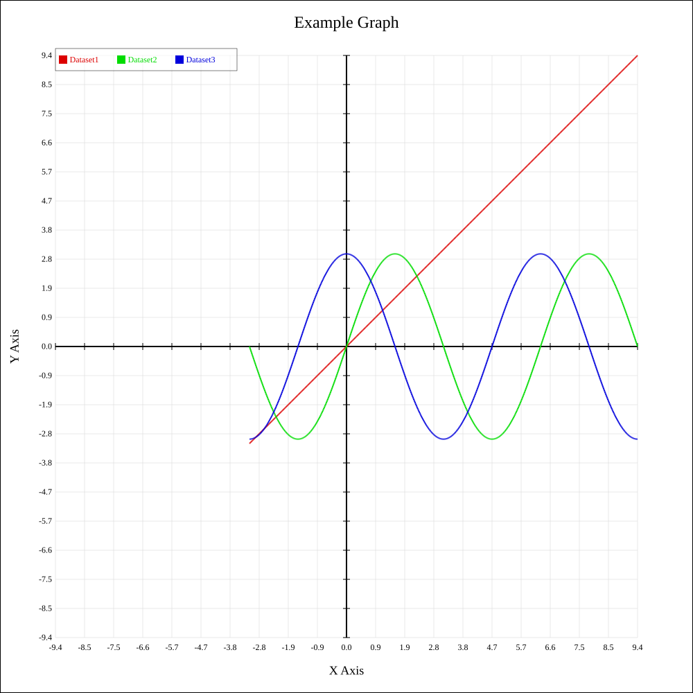

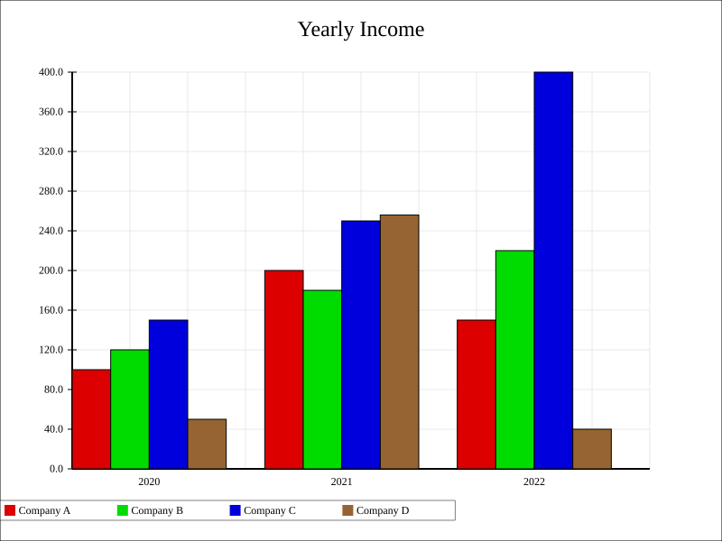
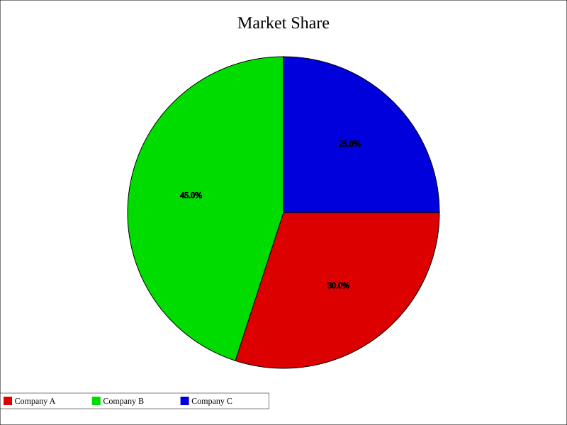
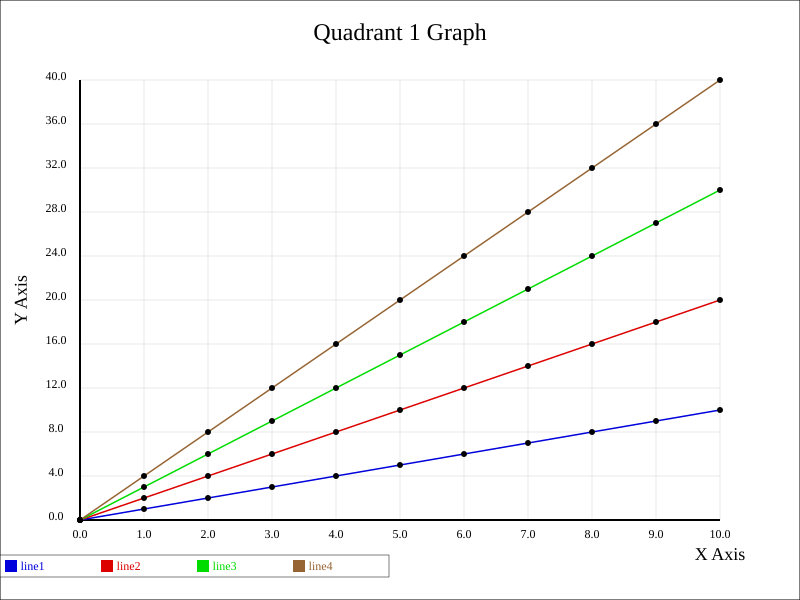
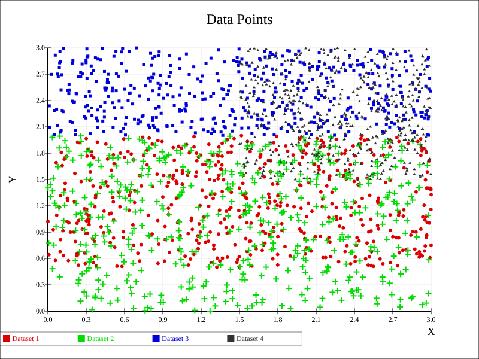


## Customization Options
- **Title**: Set the title of the plot.
- **X and Y Labels**: Label the x-axis and y-axis.
- **Dimensions**: Specify the width and height of the plot.
- **Colors**: Customize background, axis, and line colors.
- **Margins**: Add margins around the plot.
- **Line Thickness**: Adjust the thickness of data lines.


## Installation

Add the following to your `Cargo.toml`:
```toml
[dependencies]
ab_glyph = "0.2.29"
image = "0.25"    # For rendering images
imageproc = "0.25.0"
minifb = "0.27.0"
nalgebra = "0.30" # For handling data (optional)
rand = "0.8.5"    # For testing (optional)
rusttype = "0.9.3"
```

## License
This project is licensed under the GNU Version 3 License.

## Contributing
Contributions are welcome! Feel free to open issues or submit pull requests to improve the library.

---

Happy plotting! 🚀
